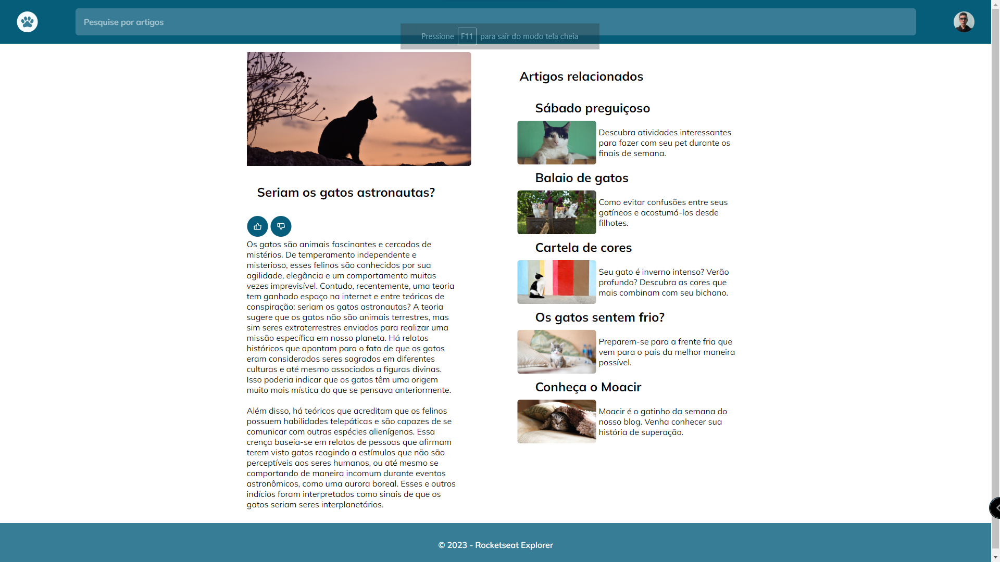

<h1 align="center"> cat blog </h1>

In this project I did an activity from Rockteset's explorer trail that expands knowledge about responsiveness by creating a cat blog 

  <a href="#-tecnologias">technologies</a>&nbsp;&nbsp;&nbsp;|&nbsp;&nbsp;&nbsp;
  <a href="#-projeto">Project</a>&nbsp;&nbsp;&nbsp;|&nbsp;&nbsp;&nbsp;
  <a href="#-layout">Layout</a>&nbsp;&nbsp;&nbsp;|&nbsp;&nbsp;&nbsp;
  <a href="#memo-licença">License</a>

  

 

   

## 🚀 technologies

This project was developed with the following technologies:

- HTML e CSS
- Git e Github
- Figma

## 💻 Project

In this project I did a cat blog responsiveness activity

- [Visit the project online] (https://khnum782.github.io/Blog-de-gatos/)

## 🔖 Layout

You can view the project layout through [DESSE LINK](https://www.figma.com/file/aAEMaI5kXGNcSjUSG9eyBx/Blog-de-Gatos-%E2%80%A2-Desafio-Explorer-(Community)?node-id=101%3A91&mode=dev)It is necessary to have an account [Figma](https://figma.com)
to access it.
## :memo: License

This project is under license MIT.

